<div align="center">

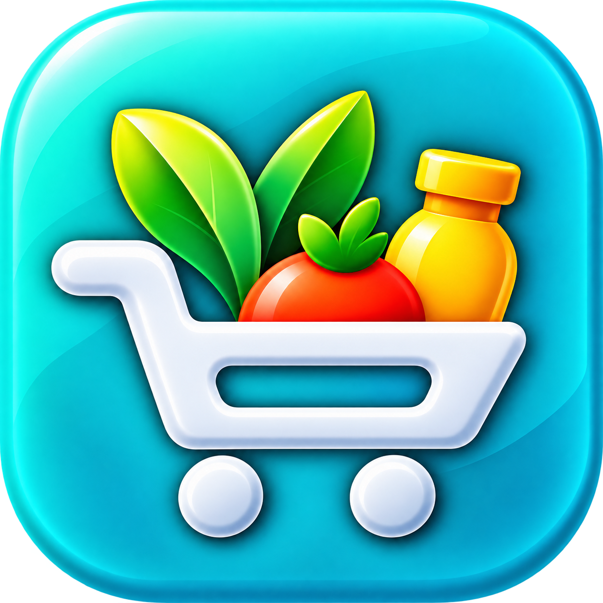

# Freegi

### Fresh groceries, thoughtfully designed.

A modern Flutter grocery-shopping application featuring onboarding, location setup, product discovery, cart management, order tracking, and a polished mobile-first interface.

[](https://flutter.dev/)
[](https://dart.dev/)


</div>

---

## About Freegi

Freegi is a portfolio-level grocery-shopping mobile application built with Flutter and Dart. It presents a complete customer journey—from onboarding and authentication to location selection, category browsing, product details, cart management, orders, and profile controls.

The project focuses on clean mobile UI, responsive layouts, sticky headers, fixed navigation, local persistence, reusable components, location services, and practical e-commerce interaction patterns.

## App Preview

### App Introduction

<p align="center">
  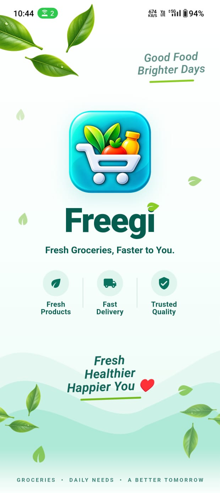
  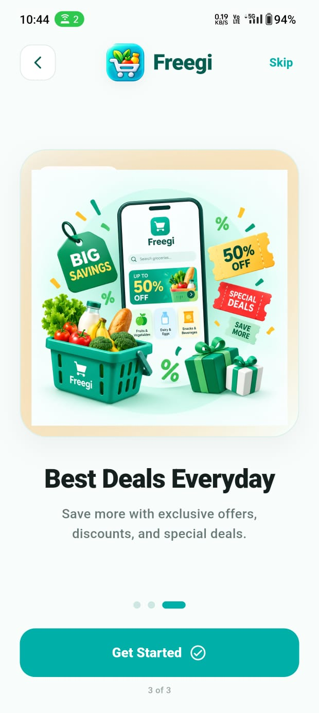
  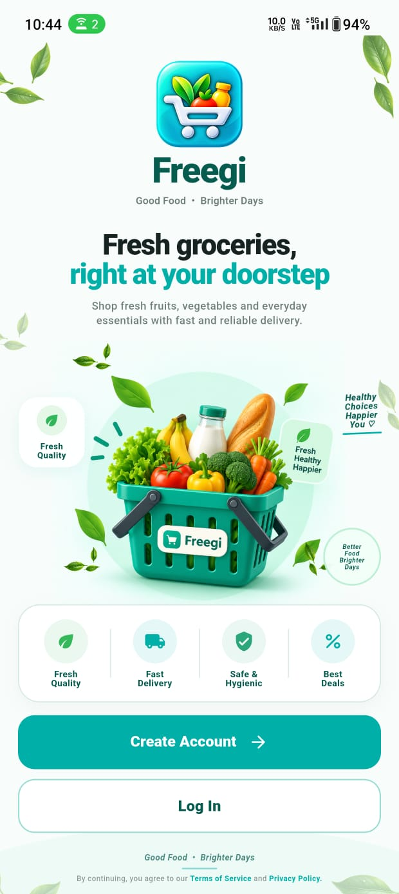
</p>

### Authentication & Location

<p align="center">
  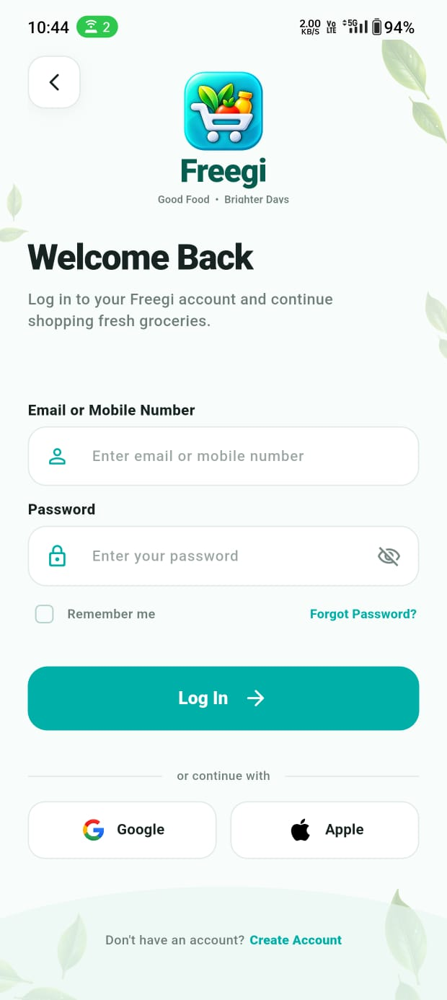
  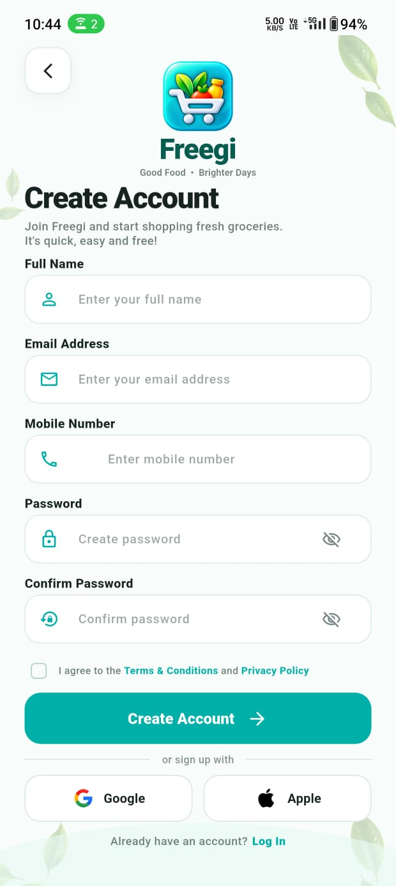
  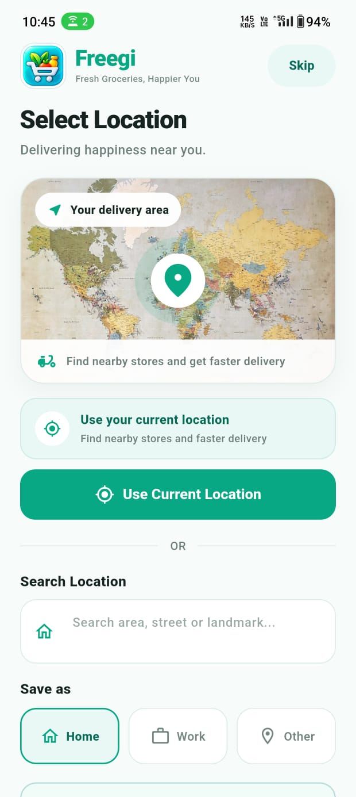
</p>

Returning users can log in and continue directly to the app. New users complete account creation and first-time location setup before entering the shopping experience.

### Shopping Experience

<p align="center">
  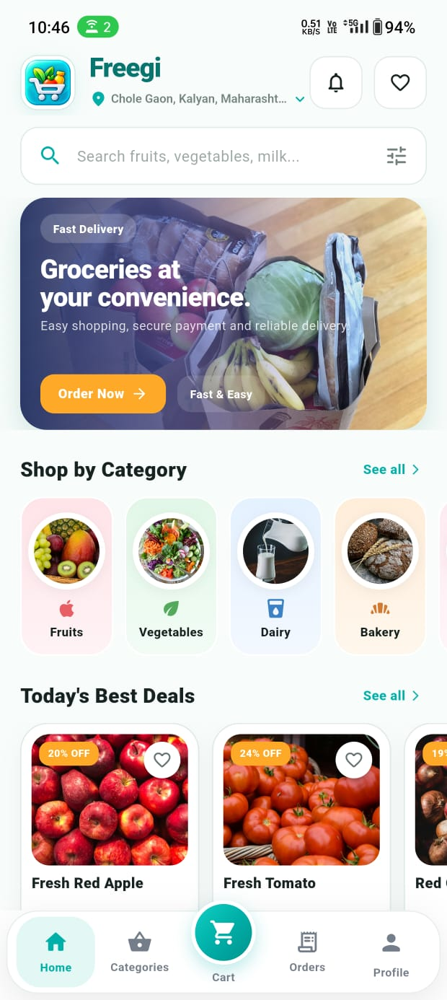
  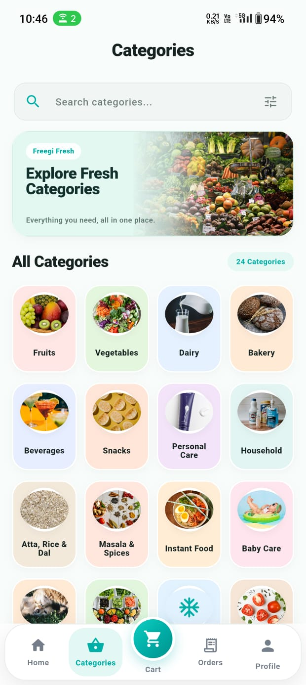
  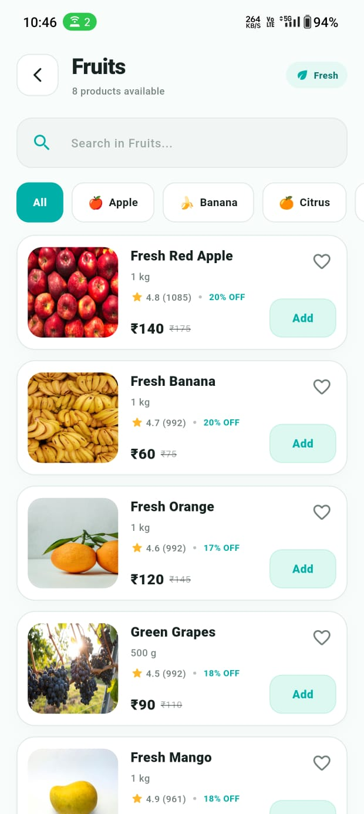
  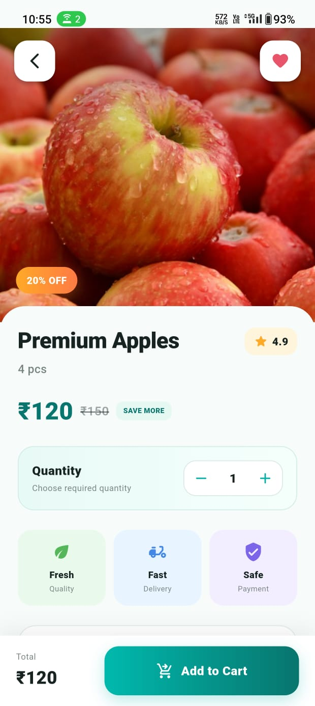
</p>

### Orders & Account

<p align="center">
  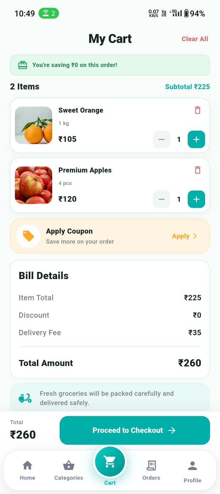
  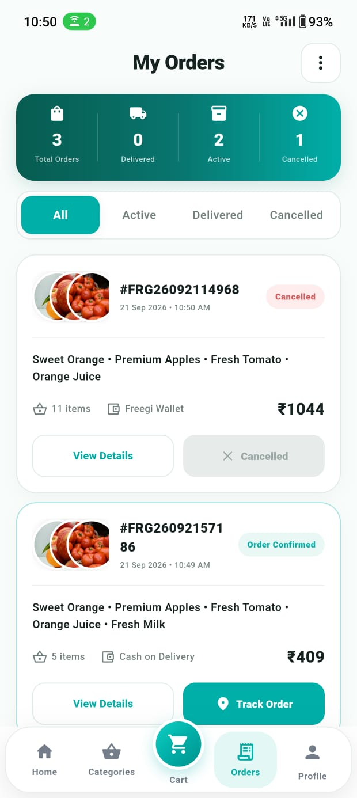
  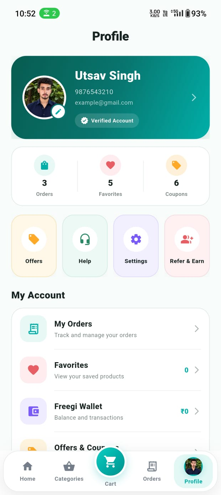
</p>

---

## Key Features

### Onboarding and authentication

- Branded splash, onboarding, and welcome experience
- Login and create-account interfaces
- Form validation and session persistence
- First-time location setup
- Returning-user navigation flow

### Location experience

- Current-location access using device permissions
- Geolocation and reverse geocoding
- Saved location display
- Change-location flow from the main application

### Shopping and discovery

- Grocery-focused Home screen
- Search, promotional banners, and featured content
- Category browsing
- Category-specific product listings
- Product details
- Favorites and product actions
- Responsive product cards and layouts

### Cart and orders

- Add-to-cart interactions
- Quantity and cart-item controls
- Savings and bill-detail presentation
- Fixed checkout summary above bottom navigation
- Orders with All, Active, Delivered, and Cancelled filters
- Order status and history interface

### Profile and settings

- Customer profile and activity summary
- Saved addresses, favorites, wallet, offers, and account shortcuts
- Profile image selection and cropping
- Notification preferences
- Language, privacy, security, help, sharing, and app information
- Locally persisted preferences

### UI and navigation

- Fixed five-tab bottom navigation
- Sticky and compact headers on scrolling
- Content protected from bottom-bar overlap
- Consistent teal visual identity
- Mobile-first responsive layouts
- Reusable Flutter components

## Tech Stack

| Technology | Usage |
|---|---|
| Flutter | Cross-platform mobile UI |
| Dart | Application logic |
| SharedPreferences | Local session and preference persistence |
| Geolocator | Device-location access |
| Geocoding | Coordinates-to-address conversion |
| Image Picker | Profile image selection |
| Image Cropper | Profile image editing |
| Path Provider | Local file-path support |
| Share Plus | Native sharing actions |
| Material Design | Components, navigation, and styling |

## Project Structure

```text
freegi/
├── android/
├── assets/
│   ├── icon/
│   └── images/
├── lib/
│   ├── data/
│   ├── models/
│   ├── screens/
│   ├── services/
│   └── main.dart
├── screenshots/
├── pubspec.yaml
└── README.md
```

## Getting Started

### Prerequisites

- Flutter SDK 3.47.1 or compatible
- Dart SDK 3.13.1 or compatible
- Android SDK
- Android Studio or Visual Studio Code
- Android device or emulator

Verify the Flutter environment:

```bash
flutter doctor
```

### Installation

```bash
git clone https://github.com/utsavsingh1920/freegi.git
cd freegi
flutter pub get
flutter run
```

Location features require Android location permission and an enabled device location service.

## Project Status

- Version: **1.0.0**
- Android release build created
- Main customer journey implemented
- Sticky headers and scrolling behavior refined
- Release APK kept outside the public source repository
- Designed as an educational and portfolio application

## Current Scope

Freegi currently uses local/sample product data and locally persisted user preferences. It demonstrates the customer-side grocery-shopping experience and does not process real payments or connect to a production commerce backend.

## Roadmap

- Connect products, authentication, and orders to a backend
- Add real-time inventory and delivery-slot availability
- Integrate secure checkout and payment services
- Add automated widget and integration tests
- Improve accessibility and offline caching
- Introduce customer support and live order tracking

## Developer

**Utsav Singh**  
B.Sc. Information Technology Graduate  
Flutter and Full-Stack Development Enthusiast

- GitHub: [@utsavsingh1920](https://github.com/utsavsingh1920)

## Disclaimer

Freegi is an educational and portfolio project. Product names, images, brands, and pricing shown in the application are used only for interface demonstration. Freegi is not currently a production grocery-delivery service.

---

<div align="center">

**Built with Flutter and 💚 by Utsav Singh**

© 2026 Utsav Singh

</div>
